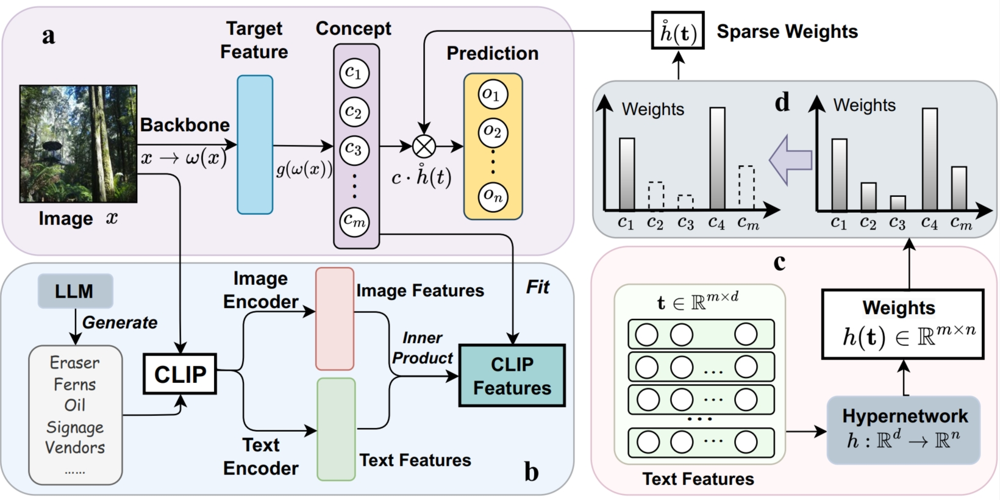
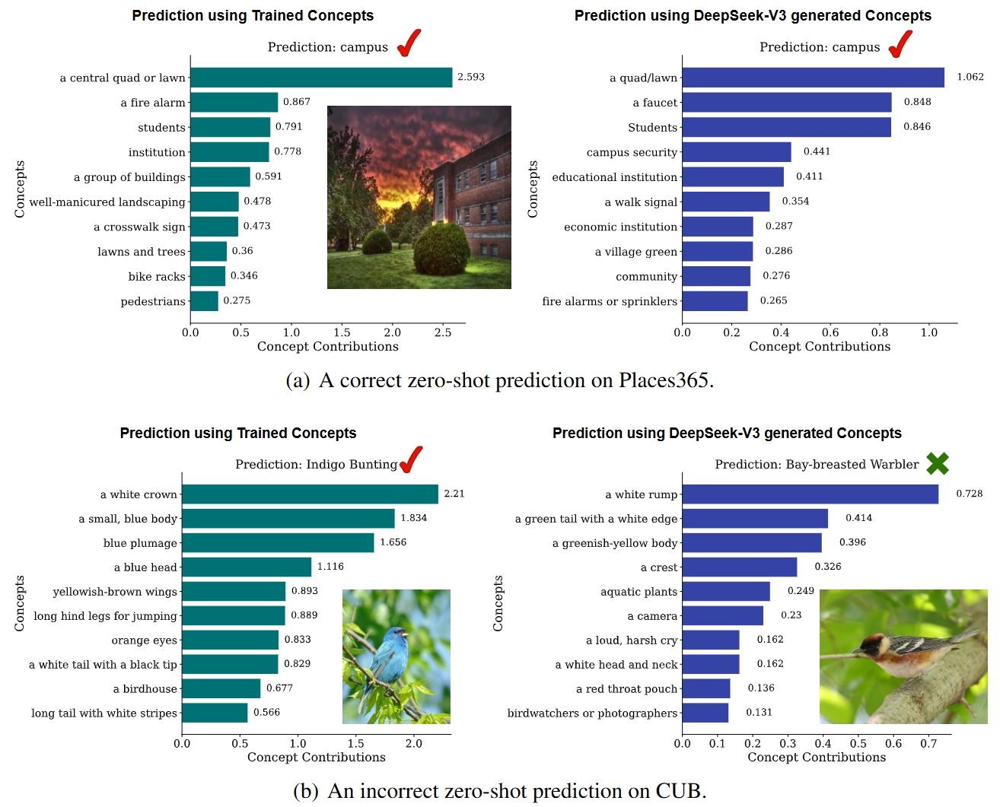

# FCBM README

This is an implementation of the AAAI 2026 paper **Flexible Concept Bottleneck Model** (FCBM).  



*Figure 1*: **FCBM Pipeline**. The pipeline of FCBM consists of several key components: a) The basic two-stage learning framework. b) Concept sets are generated by large language models (LLMs), which are then used to form CLIP features. c) A hypernetwork is employed to generate weights based on text features. d) Sparsemax is utilized to enforce sparsity in the weights during both the training and inference stages. 

## Prerequisites
- Please run `pip install -r requirements.txt` to achieve the environment.
- This repo is executed under `torch=2.4.0+cu118` and `pytorch-lightning=2.3.3`. Please find the suitable versions of [torch](https://pytorch.org/) and [pytorch-lightning](https://lightning.ai/docs/pytorch/stable/versioning.html#compatibility-matrix).

## Datasets
We use five datasets, including CIFAR10, CIFAR100, CUB, Places365, and ImageNet. Most of them can be downloaded automatically in the code.  
- CUB dataset: https://www.vision.caltech.edu/datasets/cub_200_2011/

## Usage (Take CIFAR10 for example)
Train/Inference for x->c and c->y using the same script in the following, but please modify the `concept_mode` and `hyper_mode` in `configs/cifar10.yaml` to train/test.
```
python main_vlm.py -d cifar10
```

## Visualizations

*Figure 2*: Zero-shot Generalization in terms of concepts. We test the accuracy of FCBM with three groups of concepts, including the trained, the DeepSeek-V3-generated, and the GPT-4o-generated concepts across five datasets using ResNet50 and ViT-L/14 backbones.

## Citations
If you find our paper/code useful in your research, please cite

```
@inproceedings{du2026flexible,
  title={Flexible Concept Bottleneck Model},
  author={Du, Xingbo and Dou, Qiantong and Fan, Lei and Zhang, Rui},
  booktitle={Proceedings of the AAAI Conference on Artificial Intelligence},
  year={2026}
}
```

## Directory

```
|-- README.md
|-- main_vlm.py
|-- requirements.txt
|-- clip
|-- configs
    |-- cifar10.yaml
    |-- cifar100.yaml
    |-- cifar100_RN50.yaml
    |-- cifar10_RN50.yaml
    |-- cub.yaml
    |-- cub_RN50.yaml
    |-- imagenet.yaml
    |-- imagenet_RN50.yaml
    |-- places365.yaml
    |-- places365_RN50.yaml
|-- data
    |-- __init__.py
    |-- data_interface.py
|-- models
    |-- __init__.py
    |-- model_interface.py
    |-- vlm_fcbm.py
|-- utils
    |-- __init__.py
    |-- analysis.py
    |-- base_utils.py
    |-- dataloader.py
    |-- self_attn.py
    |-- sparsemax.py
    |-- vlm_data_utils.py
    |-- vlm_utils.py
```